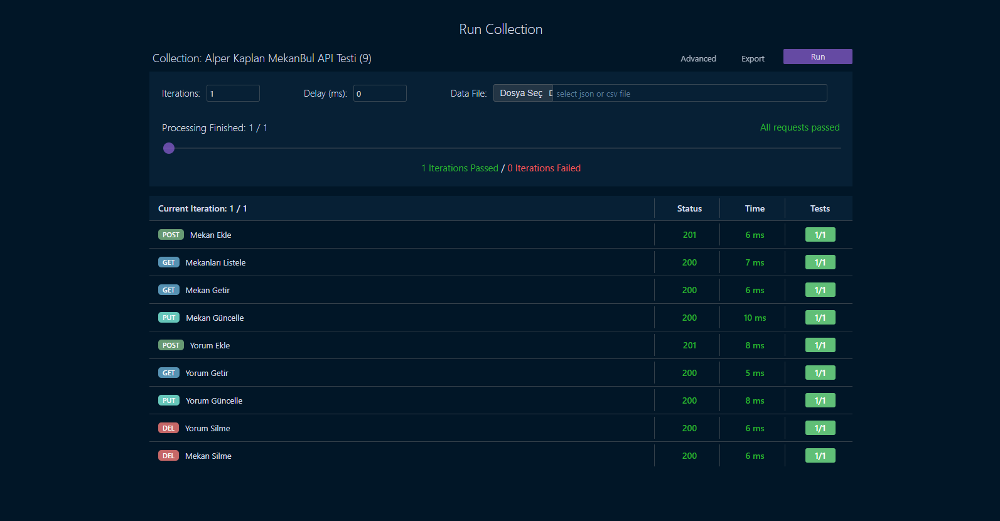
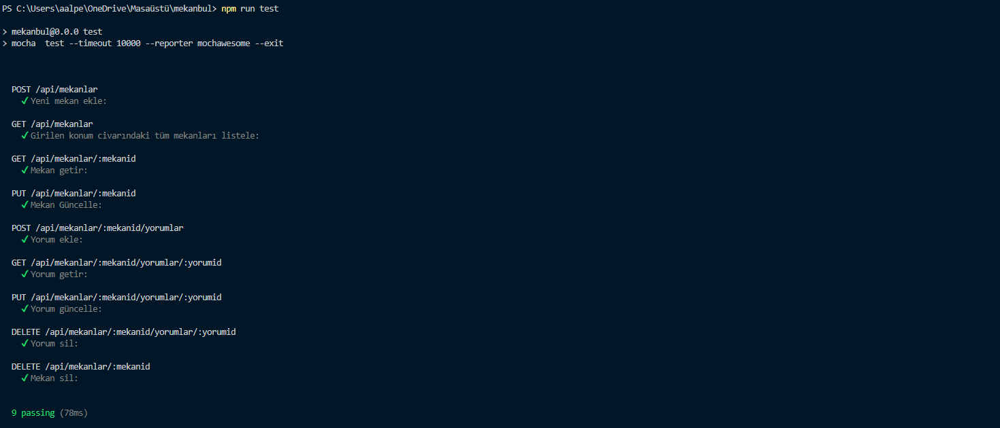
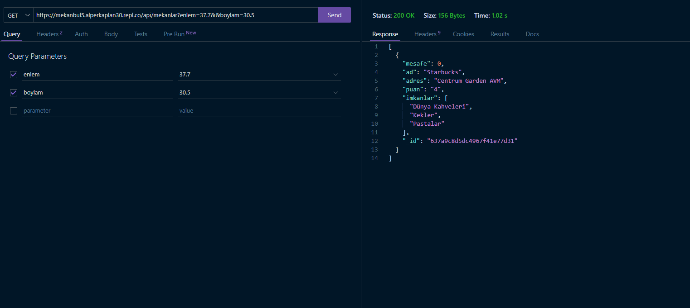
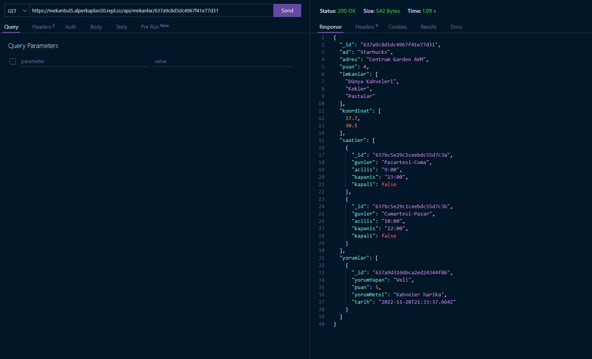
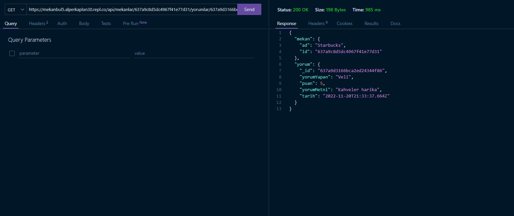

# MekanBul Uygulaması 
Süleyman Demirel Üniversitesi Bilgisayar Mühendisliği "Web Teknolojileri ve Programlama" dersi kapsamında geliştirilen web uygulamasıdır. MekanBul insanların bulunduğu konum civarındaki mekanları ve mekanların sunduğu imkanları görmelerini, mekanlara yorum yapabilmelerini sağlamaktadır.

# MekanBul Replit Adresi
[https://mekanbul.alperkaplan30.repl.co?enlem=37&boylam=30](https://mekanbul.alperkaplan30.repl.co?enlem=37&boylam=30)

# API Collections Test

# API Mocha Test

# MekanBul Rest API Adresleri

[1- Girilen Konum Civarındaki Mekanları Listele](https://mekanbul5.alperkaplan30.repl.co/api/mekanlar?enlem=37.7&&boylam=30.5)

[2- Mekanın Id'si İle Mekan Bilgilerini Getir](https://mekanbul5.alperkaplan30.repl.co/api/mekanlar/637a9c8d5dc4967f41e77d31)

[3- Bir Mekana Ait Belirli Yorumu Getir](https://mekanbul5.alperkaplan30.repl.co/api/mekanlar/637a9c8d5dc4967f41e77d31/yorumlar/637a9d3166bca2ed24344f86)

